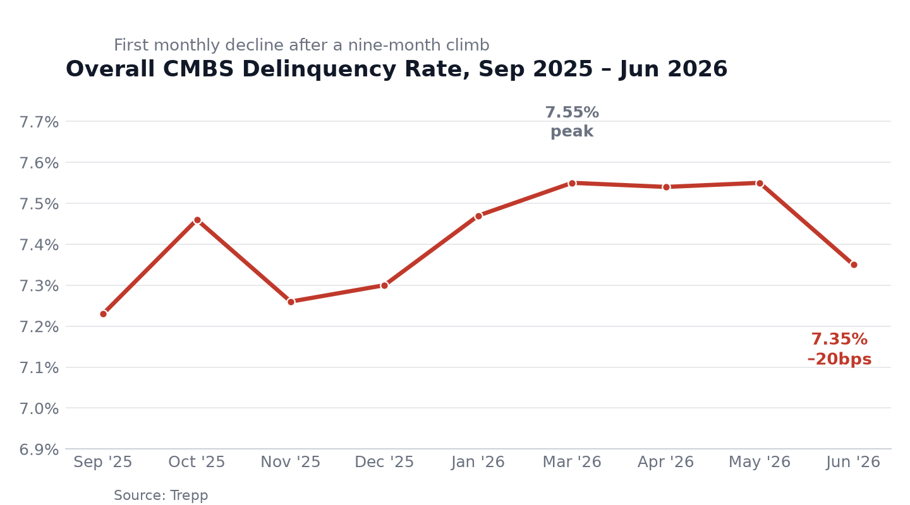

# The Canavati Brief — Monday, July 6, 2026

## 1 big thing: CMBS delinquency cools, but cracks widen underneath

The headline CMBS delinquency rate **fell 20bps to 7.35% in June** — the first meaningful pullback after nine straight months climbing from 7.23% (Sep. '25) to a cycle-high 7.55% (Mar.–May '26).

- **By the numbers:** Lodging led the improvement, down 79bps to 5.22%; industrial eased 11bps to 1.20%.
- **Yes, but:** Multifamily rose 28bps to 7.23% and retail jumped 30bps to 6.91%. Office held near record territory at 11.57% (+4bps) — still the sector to watch.
- **For dummies:** Fewer loans overall are going bad, but the improvement is uneven — apartments and retail are getting worse even as hotels recover, and office remains a slow-motion crisis. Don't read the headline number as an all-clear.

*Source: Trepp, via Yield PRO*

## Jobs miss cools rate-hike bets

**Driving the news:** June payrolls added just 57K vs. 115K expected, with April/May revised down a combined 74K.

**By the numbers:** 10-yr yield ~4.47%, 2-yr fell to ~4.11%. July hike odds slid to ~20%, September to ~55%.

**For dummies:** A weak jobs report makes Fed rate hikes less likely, which should keep refinancing costs from getting worse — a small tailwind for loans facing maturity this year.

*Source: CNBC, Bloomberg*

## Dead SF mall finds a buyer

**Driving the news:** Presidio Bay Ventures and the Prado Group are under contract to buy the shuttered San Francisco Centre mall from the lender group that took it back via foreclosure last November.

**For dummies:** A trophy-bad REO asset finally has an exit. It's a useful data point for underwriting worst-case retail recoveries — patience plus redevelopment capital can eventually clear even dead retail.

*Source: SF Examiner*

## Miami office towers set for auction

**What's next:** Two Flagler St. office towers tied to a Stonerock Capital affiliate face a foreclosure sale auction on July 20 after a final judgment was entered.

**For dummies:** Another office loan is converting from paper distress into an actual sale — worth tracking as a live comp for office REO pricing.

*Source: Bisnow*

---

**What I'm watching:** Whether June's delinquency dip holds once second-half 2026 office and retail maturities hit the special-servicing pipeline.

---
*Compiled from public reporting for internal use. Not investment advice.*
